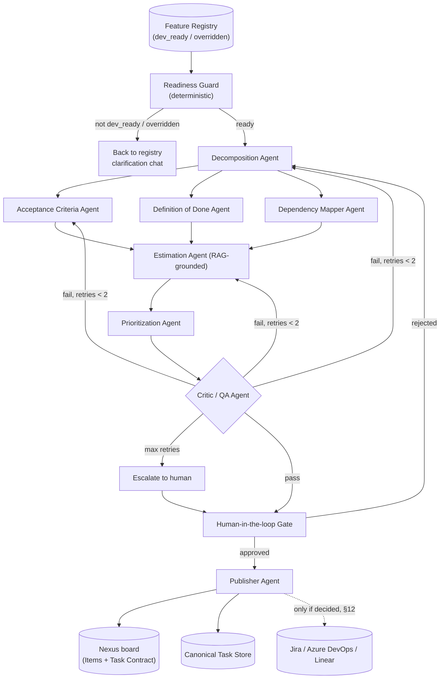

# Feature Registry → Developer Task Factory
### Agentic Workflow — Implementation Guide

> **Stage 3 of 3.** Input: features the [`FEATURE_REGISTRY.md`](FEATURE_REGISTRY.md) stage marked
> `dev_ready` or `overridden` (features themselves come from [`ingestion.md`](ingestion.md)).
> Shared data model, lifecycle, citation shape and LangGraph conventions:
> [`feature-pipeline-contract.md`](feature-pipeline-contract.md) — that file wins on any conflict.
> Stack: Postgres + Qdrant + Gemini via Vertex AI + LangGraph. Output lands on the Nexus board
> as `Item`s extended by the P1 Task Contract (master plan, catalog B).

This document specifies the full implementation of an agentic pipeline that takes entries from the **Feature Registry** and produces fully-specified developer tasks (description, acceptance criteria, definition of done, priority, estimate) ready to publish to the board after human approval.

---

## 1. Goals & Non-Goals

**Goals**
- Turn a feature spec into a set of implementable, well-scoped developer tasks with zero manual re-writing in the common case.
- Every generated artifact (task, AC, DoD line) must be traceable back to the source feature text.
- Nothing publishes to a real tracker without human approval.
- Regenerating a changed feature must not clobber in-progress or completed tasks.

**Non-Goals (v1)**
- Fully autonomous publishing without human review.
- Estimating novel/unprecedented work with high confidence (flag it instead).
- Replacing product discovery — this pipeline assumes the feature is already reasonably well-specified or can be made so via the clarification loop.

---

## 2. High-Level Architecture



**Orchestration pattern:** the LangGraph `breakdown` graph (contract §6) — shared Postgres checkpointer (thread id = `feature_id`), human steps as `interrupt`s, audit rows in the shared `audit_events` table. Each LLM node is a single-responsibility **Gemini (Vertex AI)** call with **structured output enforced via JSON schema / function calling** — never free-text parsing. The Readiness Guard is a plain deterministic node.

---

## 3. Data Model

### 3.1 Feature (read from the shared registry — not owned here)

This pipeline **reads** the shared `features` / `feature_versions` / `feature_relations` records
(contract §2) as delivered by the registry stage's output contract (FEATURE_REGISTRY.md §11a).
The view the agents receive:

```json
{
  "id": "feat_2f9a",
  "project_id": "proj_7",
  "title": "string",                       // features.name
  "description": "string",                 // current feature_versions.description
  "spec_version": 3,                       // current feature_versions.version_no
  "lifecycle_state": "dev_ready | overridden",
  "classification": { "feature_type": "…", "risk_level": "…", "exposes_api": true, "touches_pii": false },
  "readiness_fields": {                    // readiness.fields — each { value, confidence, source: source_ref }
    "problem_statement": {}, "success_criteria": {}, "business_goal": {}, "target_persona": {},
    "constraints": {}, "api_contract": {}, "ui_states": {}, "pii_handling": {}, "rollback_plan": {}
  },
  "open_gaps": ["rate_limits"],            // planning gaps + override.unresolved_fields
  "dependencies": ["feat_id"]              // feature_relations where relation_type = depends_on
}
```

`business_goal`, `target_persona` and `constraints` are readiness fields (FEATURE_REGISTRY.md
§3.3), not top-level columns. Lifecycle states this pipeline sets: `in_breakdown → needs_review →
broken_down` (contract §3); there is no separate feature `status` enum.

### 3.2 Task (generated output)

```json
{
  "id": "task_7c1e",
  "feature_id": "feat_2f9a",
  "feature_spec_version": 3,
  "title": "string",
  "description": "string",
  "role": "frontend | backend | database | infra | qa | design | docs",
  "acceptance_criteria": [
    {
      "id": "ac_1",
      "given": "string",
      "when": "string",
      "then": "string",
      "source_requirement_ref": {
        "readiness_field": "success_criteria | null",
        "source_ref": { "doc_id": "…", "doc_type": "upload | chat", "chunk_id": "…", "section": "…", "char_start": 0, "char_end": 0, "snippet": "…" }
      }
    }
  ],
  "open_questions": [
    { "field_id": "rate_limits", "reason": "planning gap | overridden", "needs_review": true }
  ],
  "definition_of_done": [
    { "id": "dod_1", "item": "string", "origin": "standard | feature_specific" }
  ],
  "priority": {
    "method": "RICE | MoSCoW",
    "score": 0.0,
    "tag": "must | should | could | wont",
    "rank": 1
  },
  "estimate": {
    "value": 5,
    "unit": "story_points | hours",
    "confidence": "low | medium | high",
    "basis": ["task_id_of_similar_past_task", "..."]
  },
  "dependencies": ["task_id"],
  "status": "draft | needs_review | approved | rejected | published | in_progress | done",
  "board_item_id": "number | null",
  "generated_by": "pipeline_run_id",
  "reviewed_by": "user_id | null",
  "created_at": "ISO8601",
  "updated_at": "ISO8601"
}
```

### 3.2a Mapping to the board (`client/src/types.ts` is the API contract — CLAUDE.md)

On publish, each approved task becomes a board `Item`; the fields `Item` lacks go into the P1
**Task Contract** extension of `Item` (master plan catalog B: rationale, Given/When/Then AC, DoD,
context pack, constraints, dependencies, open questions, agent-readiness).

| Task field | Board `Item` / Task Contract |
| --- | --- |
| `title`, `description` | `Item.title`, `Item.description` |
| `role` | `Item.area`; suggested `Item.assignee` (human handle or `agent:<id>` from the Agent catalog) — suggestion only, a human confirms |
| `priority.tag` / `rank` | `Item.priority`: must → `P0`/`P1` (by rank), should → `P2`, could → `P3`; `wont` is not published |
| `status: published` | `Item.status = 'inbox'` |
| `acceptance_criteria[]` | Task Contract AC (reuses `AcceptanceCriterion` in `types.ts`), each with its citation |
| `definition_of_done[]`, `estimate`, `dependencies`, `open_questions` | Task Contract fields |
| first AC's `source_ref` | `Item.source` (`type`, `name`, `snippet`) so the card shows a citation |
| `in_progress` / `done` | read back from `Item.status` — the pipeline never modifies these (§5) |

### 3.3 Storage

- **Primary store:** Postgres — the shared `features` tables (read-only here, except `lifecycle_state`), plus `tasks`, `task_dependencies`, `pipeline_runs`, `critic_reports`. All scoped by `project_id`.
- **Vector store:** Qdrant collection `historical_tasks` (same Qdrant as ingestion), Gemini embeddings of completed tasks (title + description + actual effort) for RAG-based analogy estimation.
- **Audit log:** the shared `audit_events` table (contract §6), `graph: "breakdown"` — every agent decision, input/output, and human override.

---

## 4. Agent Specifications

Each agent is a single LLM call (or small internal chain) with a fixed system prompt, a JSON schema for output, and a maximum retry count of 2 before escalation.

### 4.1 Readiness Guard (deterministic — replaces the former Intake / Requirements Analyst Agent)
- **Why not an agent:** "is the spec sufficient?" is exactly what the Feature Registry stage already decides, with rubrics, confidence scores and a clarification chat. Re-judging it here would create a second, inconsistent clarification loop.
- **Input:** the feature record (§3.1).
- **Job:** pass only if `lifecycle_state ∈ {dev_ready, overridden}`; otherwise stop and route the feature back to the registry. On pass, set `lifecycle_state = in_breakdown`.
- **Output:** `{ pass: bool, open_gaps: string[] }` — `open_gaps` (planning gaps + `override.unresolved_fields`) are carried into the tasks they affect as `open_questions`.

### 4.2 Decomposition Agent
- **Input:** feature view (§3.1): description **plus readiness fields** (`api_contract`, `ui_states`, `pii_handling`, `data_migration_plan`, …) and classification.
- **Job:** split into tasks by role/layer (FE, BE, DB, infra, QA, docs). Avoid tasks larger than ~1–2 days of work; avoid tasks smaller than ~1 hour (merge those).
- **Output:** list of `{ title, description, role }`.

### 4.3 Acceptance Criteria Agent
- **Input:** one task + full feature view (description, readiness fields with their `source_ref`s, `open_gaps`).
- **Job:** write 2–6 Given/When/Then criteria. Each must be objectively verifiable (no "works well", "is fast", "is intuitive" without a measurable threshold) and must cite a `source_requirement_ref` whose `source_ref` is copied from the readiness field or description sentence it came from — never invented. No citable source ⇒ no AC; the gap becomes an `open_question` instead.
- **Output:** `acceptance_criteria[]` as in the schema above.

### 4.4 Definition of Done Agent
- **Input:** task + org DoD template (config, see §6.1) + readiness fields (`constraints`, `rollback_plan`, `data_migration_plan`, `pii_handling`, `accessibility_notes`, …).
- **Job:** merge standard DoD items with any feature-specific ones driven by those fields (e.g., "load-tested to 500 rps" only if `constraints` states a perf target; "rollback plan verified on staging" only if `rollback_plan` is present). Feature-specific items cite the field's `source_ref`.
- **Output:** `definition_of_done[]`.

### 4.5 Dependency Mapper Agent
- **Input:** all tasks generated for the feature (+ tasks of features linked by `feature_relations (depends_on)`).
- **Job:** build the dependency graph; detect cycles and flag them for human resolution rather than silently breaking them.
- **Output:** `dependencies[]` per task.

### 4.6 Estimation Agent
- **Input:** task + top-k similar historical tasks (via vector search) with their actual effort.
- **Job:** estimate by analogy/relative sizing, not first-principles guessing. Attach `confidence` and `basis` (which past tasks it anchored to).
- **Rule:** if fewer than 2 relevant historical anchors are found, confidence is forced to `low` and the task is flagged for human sizing.
- **Cold start:** there is no history of completed tasks with actual effort yet (board `Item`s carry no effort field). Until `historical_tasks` is populated from completed, published tasks, every estimate is `low` confidence + "needs human sizing".
- Tasks with open questions on sizing-relevant fields are also forced to `low`.

### 4.7 Prioritization Agent
- **Input:** all tasks for the feature + dependency graph.
- **Job:** score via RICE or MoSCoW (config-driven, §6.1), using the `business_goal` readiness field; promote low-scored tasks that block ≥2 other tasks.
- **Output:** `priority` per task (mapped to board `P0–P3` on publish, §3.2a).

### 4.7a Duplicate / conflict check (before the human gate)
- **Input:** each generated task + existing board Items and decisions of the same project.
- **Job:** flag tasks that duplicate or conflict with existing work, as ranked candidates with confidence (the board's `VerdictDetail` / `Candidate[]` shape), for the reviewer to confirm. Never auto-drops a task. This is also what stops a regeneration from re-creating tasks that already exist.

### 4.8 Critic / QA Agent
- **Input:** full generated task set for the feature.
- **Job:** score against a fixed rubric:
  1. Every AC is objectively testable.
  2. Every AC/DoD item has a valid `source_requirement_ref` or is tagged `standard`.
  3. No task's scope exceeds what's in the feature spec (no invented requirements).
  4. DoD does not contradict AC.
  5. Estimates for similarly-sized tasks are internally consistent.
- **Output:** `{ pass: bool, failures: [{ task_id, rule, detail }] }`.
- **On fail:** route failure back to the specific responsible agent with the failure detail as extra context. Max 2 loops, then escalate.

### 4.9 Publisher Agent
- **Input:** human-approved task set.
- **Job:** write each approved task to the **Nexus board** as an `Item` (+ Task Contract, §3.2a) and store its `board_item_id`; write the canonical record to the task store; set feature `lifecycle_state = broken_down`. External trackers (Jira / Azure DevOps / Linear) only if §12 decides so — the master plan currently has Jira as read-only with two-way sync out of scope.
- **Where Items live today:** board data is in the Node SQLite store (`client/db/`, served by `client/server.ts`). Until Items move to the Python backend, the Publisher writes through the Node API (§12).

---

## 5. Human-in-the-Loop Gate

- Implemented as a LangGraph `interrupt`; feature `lifecycle_state = needs_review` while waiting.
- v1 surface: the existing review queue (ingest review queue + approve/dismiss, `client/src/components/VerdictRow.tsx`). A dedicated diff view needs a `ui_ux_design.md` entry before it is built (CLAUDE.md: don't improvise screens).
- Presents a **diff view**: for a first-time generation, all tasks; for a regeneration (feature spec changed), only tasks that are new, changed, or newly orphaned (a task whose source requirement was removed).
- Tasks with `open_questions`, low-confidence estimates, or duplicate/conflict flags (§4.7a) are tinted "please review" and excluded from bulk approve.
- Reviewer actions: approve as-is / edit inline / reject with a free-text reason (routed back to Decomposition Agent as context).
- **Hard rule:** in-progress or `done` tasks are never auto-modified or deleted by a regeneration — they're shown as "unaffected" and require an explicit human action to change.

---

## 6. Configuration

### 6.1 `config/org_standards.yaml`
```yaml
definition_of_done:
  standard:
    - "Code reviewed and approved by at least 1 other engineer"
    - "Unit tests written and passing"
    - "No new linter warnings"
    - "Deployed to staging and smoke-tested"
prioritization:
  method: RICE   # or MoSCoW
estimate:
  unit: story_points   # or hours
  scale: [1, 2, 3, 5, 8, 13]
retry:
  max_critic_loops: 2
```

### 6.2 Secrets / environment
Shared with ingestion and the registry (settings in `backend/app/config.py`):
```
DATABASE_URL=              # Postgres (records + LangGraph checkpointer)
QDRANT_URL=                # same Qdrant as ingestion; collection `historical_tasks`
GCP_PROJECT_ID= / VERTEX_LOCATION=   # Gemini via Vertex AI — auth via ADC, no API key
# Only if §12 adds an external tracker:
TRACKER_TYPE=jira|azure_devops|linear
TRACKER_API_TOKEN=         # Secret Manager in deployed envs
TRACKER_PROJECT_ID=
```
`org_standards.yaml` (§6.1) is org defaults; per-project overrides live with the project's settings.

---

## 7. Suggested Repo Structure

Per CLAUDE.md, code lives under `backend/app/` (package docstring names the phase, routes
registered in `main.py`) and tests under `backend/tests/`. The shared pieces (Gemini client in
`app/ai/`, Qdrant client, checkpointer, `audit_events`, feature models) are **not** duplicated here.

```
backend/app/tasks/
  /agents
    readiness_guard.py     # deterministic, replaces intake_agent
    decomposition_agent.py
    acceptance_criteria_agent.py
    dod_agent.py
    dependency_agent.py
    estimation_agent.py
    prioritization_agent.py
    critic_agent.py
    publisher_agent.py
  /graph
    workflow.py          # LangGraph `breakdown` graph
    state.py             # pipeline state schema
  /retrieval
    embed_historical_tasks.py
    retriever.py         # Qdrant `historical_tasks`
  /publish
    board.py             # writes Items (+ Task Contract) to the board
    # trackers/ only if §12 adds one
backend/app/models/task.py, backend/app/schemas/task.py
backend/app/api/routes/tasks.py   # trigger runs, fetch runs, approve/reject
backend/app/config/org_standards.yaml
backend/tests/
  test_tasks_*.py        # unit + integration (pytest-asyncio + httpx.ASGITransport)
  fixtures/sample_features.json
```

---

## 8. Execution Flow (Runtime)

1. The registry stage moves a feature to `dev_ready` or `overridden` and enqueues a `breakdown` job (FEATURE_REGISTRY.md §11a).
2. The job creates a `pipeline_run` record and invokes the `breakdown` graph starting at the Readiness Guard.
3. Each node writes its output + input to the audit log before passing state forward.
4. On Critic pass, run pauses at `needs_review` — UI notifies the assigned reviewer.
5. On approval, Publisher writes to tracker; run marked `complete`.
6. On a new feature version after a prior successful run (ingestion UPDATE, chat answer, manual edit): the feature goes `stale` and back through the registry; when it returns `dev_ready`/`overridden`, diff the new `version_no` against each task's `feature_spec_version`, mark only affected tasks `stale`, and re-run the pipeline scoped to those tasks only. Tasks whose board `Item.status` is `in_progress` or `done` are never modified (§5).

---

## 9. Guardrails & Failure Handling

| Risk | Mitigation |
|---|---|
| Hallucinated requirements (scope creep) | `source_requirement_ref` required on every AC/DoD item; Critic rule #3 |
| Untestable acceptance criteria | Critic rule #1; reject vague adjectives without a measurable threshold |
| Bad estimates | RAG-grounded estimation + forced low-confidence flag when anchors are thin |
| Infinite critic/agent retry loops | Hard cap of 2 loops per feature run, then human escalation |
| Auto-publishing bad output | Human approval gate is non-bypassable in v1 |
| Regeneration destroying in-progress work | Diff-aware regeneration; in-progress/done tasks are immutable by the pipeline |
| Silent schema drift between agents | All agent I/O validated against JSON schema; run fails loudly on mismatch, not silently coerced |

---

## 10. Testing Strategy

- **Unit tests** per agent: fixed input feature → assert output schema validity + key invariants (e.g., every AC has a `source_requirement_ref`).
- **Golden-set regression tests:** a curated set of ~15–20 real features with human-approved "ideal" task breakdowns; run the pipeline against them on every prompt/model change and diff against the golden output.
- **Critic rubric tests:** deliberately malformed task sets (untestable AC, scope creep, contradictory DoD) fed directly to the Critic Agent to confirm it catches each failure class.
- **Integration test:** full pipeline run against a mocked tracker API, verifying end-to-end status transitions.

---

## 11. Implementation Phases

**Phase 1 — Core pipeline, no RAG, no tracker integration**
- Readiness Guard → Decomposition → AC → DoD → Critic → Human gate, output stored in the task store only (not yet on the board).

**Phase 2 — Estimation & Prioritization**
- Add historical task embeddings + Estimation Agent; add Prioritization Agent.

**Phase 3 — Board publishing**
- Publisher Agent writing approved tasks to the Nexus board (§3.2a); an external tracker client only if §12 decides so.

**Phase 4 — Regeneration & diffing**
- Spec-versioning, diff-aware re-runs, stale-task handling.

**Phase 5 — Observability**
- Dashboard over `pipeline_runs` and `critic_reports`: pass rate per rubric rule, average retry count, estimate accuracy vs actuals over time (feeds back into RAG anchor quality).

---

## 12. Open Decisions (fill in before build)

- [x] Orchestration framework → **LangGraph** (shared conventions: contract §6).
- [ ] Publish target: the Nexus board only (master plan: Jira read-only, two-way sync out of scope), or also Jira / Azure DevOps / Linear?
- [ ] Board Items: stay in Node SQLite (`client/db/`) with the Publisher writing through the Node API, or move Items to the Python backend / Postgres as part of this stage?
- [ ] Estimate unit: story points vs hours?
- [ ] Who is the human reviewer role — tech lead per feature, or a rotating review queue?
- [x] Where the features registry lives → the shared Postgres `features` tables written by ingestion and the registry stage (contract §2).
