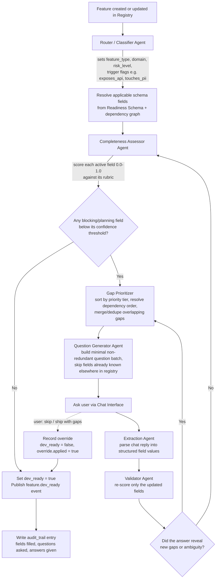

# Feature Registry Readiness Pipeline — Design Document

Sep 26, 2026 · @abdelhak mokri

> **Stage 2 of 3.** Input comes from [`ingestion.md`](ingestion.md) (features in `consolidated`
> state, with source chunks in Qdrant). Output (`dev_ready` / `overridden` features) feeds
> [`Devevloper_tasks_factory.md`](Devevloper_tasks_factory.md). Shared data model, lifecycle,
> citation shape and LangGraph conventions: [`feature-pipeline-contract.md`](feature-pipeline-contract.md)
> — that file wins on any conflict. Stack: Postgres + Qdrant + Gemini via Vertex AI + LangGraph.

## 1. Overview & Goals

### Problem statement

A Feature Registry today is just a list — some entries are fully spec'd, others are a one-line idea. When development starts on an under-specified feature, engineers stall on missing context (unclear API contracts, unknown edge cases, no defined success criteria), causing rework and delays.

### What this system does

An **agentic pipeline** sits between "feature is logged" and "feature is dev-ready." It:

1. Reads each feature entry as it's created or updated.
2. Classifies it against a typed schema to determine which information is actually relevant to it.
3. Assesses what's already present versus missing, with a confidence score per field — not a binary checklist.
4. If gaps exist, generates the smallest possible batch of non-redundant questions and asks them via chat.
5. Extracts structured answers back into the registry, re-validates, and loops until the feature clears its required bar (or the user explicitly overrides).
6. Writes back a `dev_ready` flag plus a full audit trail of what was asked and answered.

### Success criteria

- **No irrelevant questions.** A well-specified bugfix or an internal refactor should pass through with zero or near-zero questions.
- **No missing-context handoffs.** Any feature marked `dev_ready = true` has all blocking fields filled above the confidence threshold.
- **Minimal chat turns.** Gaps are batched and prioritized, not asked one at a time.
- **Traceability.** Every field's value is traceable to either the original description or a specific chat exchange.
- **Extensible schema.** New feature types or new required fields can be added without rewriting the pipeline logic.

## 2. Core Concepts

**Feature Registry** — the system of record, **populated by the ingestion stage** (contract §2): the shared `features` + `feature_versions` tables. This pipeline does not own a separate store; it fills the `classification`, `readiness` and `override` columns of the same rows. "`raw_description`" throughout this doc means the feature's **current `feature_versions.description`**, and the agents also receive the feature's **source chunks** (retrieved from Qdrant `chunks` by `feature_id`) so fields already answered in the documents are filled without asking.

**Entry point.** A run starts when ingestion hands off a `consolidated` feature (or a feature turns `stale`). `conflicted` features are blocked and never enter this pipeline until a human resolves the conflict in ingestion. Manual `POST /features` (§9) is a secondary entry point for features that come from no document.

**Readiness Schema** — a versioned, shared definition of every field a feature *could* need, independent of any single feature. It does not live per-feature; features reference it and get evaluated against the subset that applies to them.

**Field necessity types:**

| Type | Meaning | Example |
| --- | --- | --- |
| `universal_required` | Every feature needs it, no exceptions | `problem_statement`, `success_criteria`, `owner` |
| `conditional_required` | Needed only if a trigger condition on the feature is true | `api_contract` when `exposes_api = true` |
| `optional` | Useful, never blocks readiness | `analytics_events`, `rollback_plan` |

**Priority tiers** — every field (required or optional) carries a tier that determines when it blocks progress:

- **`blocking`** — blocks `dev_ready`. Development cannot start without it.
- **`planning`** — blocks sprint/iteration planning. Can be deferred past kickoff but not past estimation.
- **`optional`** — nice-to-have. Tracked but never blocks.

**Dependency chains** — some fields can only be evaluated once an earlier field's value is known. `api_contract`'s trigger condition (`exposes_api`) is itself a field that must be resolved first. The pipeline models this as a directed graph: `exposes_api → api_contract → rate_limits`. A field with unresolved dependencies is skipped, not asked about, until its parents are filled.

**Confidence-based completeness** — a field is not "present or absent." The Completeness Assessor scores how well the existing text satisfies that field's rubric (0.0–1.0). A field counts as filled only above its configured threshold (default 0.7, tunable per field). This is what lets a well-written feature description satisfy several fields implicitly, with zero questions asked.

## 3. Data Model

### 3.1 Feature Registry entry

API view of one `features` row joined with its current `feature_versions` row (contract §2):
`title` = `features.name`, `raw_description` = current version `description`, `spec_version` =
current `version_no`. Field `source` values are either the literal `"inherited"` or a
`source_ref` (contract §5) — into a document chunk or a `chat` document.

```json
{
  "feature_id": "feat_1042",
  "project_id": "proj_7",
  "lifecycle_state": "awaiting_answers",
  "spec_version": 2,
  "title": "Bulk export to CSV",
  "raw_description": "Users should be able to export their filtered table view as CSV.",
  "tags": ["user-facing-ui", "exposes_api"],
  "created_by": "user_88",
  "created_at": "2026-09-20T10:00:00Z",
  "updated_at": "2026-09-26T14:12:00Z",
  "schema_version": "1.3.0",
  "classification": {
    "feature_type": "user-facing-ui",
    "domain": "data-export",
    "risk_level": "low",
    "exposes_api": false,
    "touches_pii": true
  },
  "readiness": {
    "fields": {
      "problem_statement": { "value": "...", "confidence": 0.92,
        "source": { "doc_id": "doc_31", "doc_type": "upload", "chunk_id": "chk_4", "section": "2.1", "char_start": 812, "char_end": 960, "snippet": "..." } },
      "success_criteria": { "value": null, "confidence": 0.0, "source": null },
      "pii_handling": { "value": "...", "confidence": 0.81,
        "source": { "doc_id": "doc_58", "doc_type": "chat", "chunk_id": "chk_1", "section": "round 1", "char_start": 0, "char_end": 142, "snippet": "..." } }
    },
    "dev_ready": false,
    "open_gaps": ["success_criteria"],
    "override": { "applied": false, "by": null, "reason": null }
  },
  "audit_trail": [
    { "ts": "2026-09-20T10:05:00Z", "type": "classified", "detail": { "feature_type": "user-facing-ui" } },
    { "ts": "2026-09-20T10:06:00Z", "type": "question_asked", "field": "success_criteria", "question": "..." },
    { "ts": "2026-09-20T10:12:00Z", "type": "answer_received", "field": "success_criteria", "raw_answer": "..." }
  ]
}
```

### 3.2 Readiness Schema field definition

The schema is a separate, versioned document — not duplicated per feature. Each field:

```json
{
  "field_id": "api_contract",
  "label": "API Contract",
  "description": "Request/response shape, auth model, and versioning for any new or changed endpoint.",
  "necessity": "conditional_required",
  "required_if": { "exposes_api": true },
  "depends_on": ["exposes_api"],
  "tier": "blocking",
  "confidence_threshold": 0.7,
  "extract_from": ["raw_description", "chat"],
  "rubric": "Satisfied if the text specifies: endpoint path/method, request/response schema, auth requirement, and versioning approach.",
  "question_template": "This feature exposes a new API — what's the request/response shape, and does it need auth or versioning?",
  "applies_to_feature_types": ["user-facing-ui", "internal-service", "integration"]
}
```

### 3.3 Core field categories (starter set)

| Field | Necessity | Priority | Trigger |
| --- | --- | --- | --- |
| `problem_statement` | universal\_required | blocking | — |
| `success_criteria` | universal\_required | blocking | — |
| `owner` | universal\_required | blocking | — |
| `feature_type` / `risk_level` | universal\_required | blocking | set by classifier, not asked |
| `api_contract` | conditional\_required | blocking | `exposes_api = true` |
| `rate_limits` | conditional\_required | planning | `exposes_api = true` |
| `ui_states` (empty/error/loading) | conditional\_required | blocking | `feature_type = user-facing-ui` |
| `accessibility_notes` | conditional\_required | planning | `feature_type = user-facing-ui` |
| `pii_handling` | conditional\_required | blocking | `touches_pii = true` |
| `data_migration_plan` | conditional\_required | blocking | `changes_schema = true` |
| `rollback_plan` | conditional\_required | planning | `risk_level = high` |
| `dependencies_on_other_features` | conditional\_required | planning | `has_dependencies = true` |
| `business_goal` | universal\_required | planning | — (read by the task factory's Prioritization Agent) |
| `target_persona` | conditional\_required | planning | `feature_type = user-facing-ui` |
| `constraints` (technical / compliance / deadline) | optional | planning | — (read by the task factory's DoD Agent) |
| `analytics_events` | optional | optional | — |

This table is data, not code — it's the seed content of the schema store (3.1 below in Storage) and is meant to grow as the org's needs grow (see §10).

## 4. System Architecture

**Components:**

- **Feature Registry Store** — the shared Postgres `features` / `feature_versions` tables written by ingestion (contract §2); this stage writes `classification`, `readiness`, `override`, `lifecycle_state`.
- **Readiness Schema Store** — the versioned schema of fields (§3.2), editable independently of any feature. Postgres, scoped by `project_id` (org defaults + per-project overrides).
- **Orchestrator** — the **LangGraph `readiness` graph**. Nodes = the agents below; the Gap Prioritizer and the Convergence Controller are plain deterministic nodes (no LLM). Conditional edges implement §5's branches; the "ask the user" step and the override are LangGraph `interrupt`s. State persists via the shared Postgres checkpointer (thread id = `feature_id`), which is also the per-feature lock. The graph is the only component allowed to write to the Registry Store.
- **Agent Pool** — single-purpose Gemini (Vertex AI) calls, each stateless (all context passed in, all output structured and validated against a JSON schema before the graph accepts it): Router/Classifier, Completeness Assessor, Question Generator, Extraction Agent, Validator.
- **Chat Interface** — v1: the existing in-app clarification chat (`client/src/components/ClarificationChat.tsx`, `ClarificationTurn` in `client/src/types.ts`). Talks to the graph through a thin adapter (§9) so Slack/CLI can be added later without changing the pipeline.
- **Events** — v1: lifecycle transitions + a queued job for the next stage + WebSocket pushes to the UI (no separate event bus). Topic names in §9 are kept as the event vocabulary.

**Design principle: Orchestrator holds state, agents don't.** Every agent call is a pure function: `(feature_snapshot, schema_snapshot) → structured_output`. This makes each agent independently testable, replaceable, and re-runnable without side effects — critical for an agentic system where LLM outputs must be treated as untrusted/unreliable until validated.

**Design principle: schema-driven, not prompt-driven.** The Readiness Schema is the single source of truth for "what to ask." Agents consult it; they never improvise new required fields on their own. This is what makes the system auditable — a `dev_ready` decision can always be traced back to a specific schema version and a specific set of field scores.

## 5. Pipeline Flow

The user explicitly asked for this as a Mermaid diagram, so it's kept as Mermaid here (rather than the doc's native diagram widget) — easy to paste straight into a README or implementation ticket.



**Reading the diagram:**

- The loop from **J → D** (not straight back to **F**) is deliberate: after any answer, the Completeness Assessor re-runs over *all* active fields, not just the one just answered — a single answer can incidentally satisfy a different field too (e.g. answering "who owns this" might also clarify `success_criteria`).
- The **K → F** branch handles the common real case where a user's answer surfaces a *new* unknown ("it exposes an API" turns on the `api_contract` and `rate_limits` fields, which weren't active before).
- The escape hatch (**H -.-> M**) is the only path that reaches `Z` without all blocking fields satisfied — it's explicit and logged, never silent.

## 6. Agent Specifications

Every agent is a single LLM call with a strict output schema (JSON), validated by the Orchestrator before being trusted. None of them write directly to the Registry Store.

### 6.1 Router / Classifier Agent

- **Input:** `raw_description`, `title`, any existing `tags`.
- **Output:** `{ feature_type, domain, risk_level, trigger_flags: { exposes_api, touches_pii, changes_schema, has_dependencies, ... } }`.
- **Responsibility:** turn free text into the structured flags that activate conditional schema fields. This is the single most important agent for avoiding irrelevant questions — under-classifying causes missing questions later, over-classifying causes noise.
- **Prompt shape:** "Given this feature description, classify it against this closed set of types/domains/flags. Only set a flag to true if the text clearly implies it; when unsure, leave it false and let the Completeness Assessor surface it as a gap on `classification_uncertain`." (i.e., classifier uncertainty is itself modeled as a low-confidence field, not silently guessed.)
- **Failure mode:** misclassification. Mitigated by making `feature_type`/`risk_level` re-askable — if the Completeness Assessor later finds strong contradicting evidence (e.g. the description clearly discusses an endpoint but `exposes_api = false`), it flags a `classification_conflict` gap instead of silently trusting the classifier.

### 6.2 Completeness Assessor Agent

- **Input:** feature's current field values + the *active* subset of the Readiness Schema (resolved via `required_if` and `depends_on`).
- **Output:** per field — `{ field_id, confidence: 0.0-1.0, rationale, extracted_value_if_any }`.
- **Responsibility:** grade, don't just detect. Uses each field's `rubric` as the grading standard, not free judgment — this keeps scoring consistent across runs and features.
- **Prompt shape:** "For each field below, read its rubric and the feature's current text. Score 0-1 how completely the rubric is satisfied. If partially satisfied, extract what IS there as the value and explain what's missing in the rationale."
- **Failure mode:** score drift/inconsistency across runs. Mitigated by rubrics being concrete and checklist-like (not "is this well explained?" but "does it specify X, Y, and Z?"), and by only ever comparing a field's score to its own fixed threshold, never across fields.

### 6.3 Gap Prioritizer (deterministic, not an LLM)

- **Input:** list of under-threshold fields from the Assessor.
- **Output:** ordered gap list, dependency-filtered (fields whose `depends_on` isn't yet resolved are excluded), sorted by priority tier then by how many other pending fields depend on them.
- **Responsibility:** pure logic over the dependency graph — deliberately *not* an LLM agent, since this is a deterministic sort/filter problem and using an LLM here would add cost and non-determinism with no benefit.

### 6.4 Question Generator Agent

- **Input:** top N gaps from the Prioritizer (N capped, e.g. 3-5 per round, to avoid overwhelming the user), plus each field's `question_template` and the feature's existing context.
- **Output:** a short ordered list of natural-language questions, deduplicated and merged where two gaps can be resolved by one question (e.g. `api_contract` and `rate_limits` might become one combined question about the API).
- **Responsibility:** translate structured gaps into a human-friendly batch. Never asks about a field already filled elsewhere in the registry (checks a shared/global field cache first — see §10).
- **Prompt shape:** "Given these gaps and their templates, write the minimum number of natural questions that would resolve them. Merge related gaps. Reference the feature's own description so the question doesn't feel generic."

### 6.5 Extraction Agent

- **Input:** the questions asked + the user's raw chat reply.
- **Output:** per targeted field — `{ field_id, extracted_value, confidence, unresolved: bool }`. Also flags any *new* information volunteered that maps to a field that wasn't asked about.
- **Responsibility:** map unstructured chat back to structured fields. Marks a field `unresolved` (rather than guessing) if the answer was off-topic, contradictory, or a non-answer ("not sure").
- **Failure mode:** silent misextraction. Mitigated by the Validator (6.6) independently re-scoring rather than trusting extraction confidence directly.

### 6.6 Validator Agent

- **Input:** the newly extracted values, re-run through the same rubric-scoring logic as the Completeness Assessor (in fact the same underlying prompt/model, but scoped to just the updated fields — cheaper than a full re-pass).
- **Output:** confirmed field scores; may also flag that an answer, while addressing the asked question, exposes an entirely new trigger flag (e.g. "turns out it also needs a database migration") — this gets routed back to the Router/Classifier to re-resolve active fields, not silently absorbed.
- **Responsibility:** the check that prevents a vague or evasive chat answer from being accepted as "done."

### 6.7 Convergence Controller (part of the Orchestrator, not a separate LLM agent)

- Tracks round count per feature; caps rounds (e.g. 5) before forcing a decision point: either all blocking fields are resolved, or the pipeline explicitly surfaces the remaining gaps to the user with the override option (§7). This prevents infinite question loops on a genuinely ambiguous feature.

## 7. State Machine & Convergence Logic

### Feature states

| State | Meaning | Entered from |
| --- | --- | --- |
| `consolidated` | Handed off by ingestion, not yet classified (replaces `new`) | ingestion |
| `conflicted` | Ingestion found a contradiction — **blocked**, this pipeline does not run | ingestion |
| `classified` | Router has run, active fields resolved | `consolidated`, `stale` |
| `assessing` | Completeness Assessor running | `classified`, `answered` |
| `awaiting_answers` | Questions sent, waiting on user | `assessing` (gaps found) |
| `answered` | User replied, Extraction/Validator running | `awaiting_answers` |
| `dev_ready` | All blocking fields above threshold | `assessing` (no gaps) |
| `overridden` | User chose to proceed with known gaps | `awaiting_answers` |
| `stale` | A new `feature_version` was created after classification; re-enters `classified` | any state after `consolidated` (incl. the task factory's `broken_down`) |

After `dev_ready` / `overridden`, the task factory owns the next states (`in_breakdown → needs_review → broken_down`) — see contract §3.

### Transitions & guards

- `assessing → dev_ready` only if **every** active blocking field's confidence ≥ its threshold. `planning` gaps do not block this transition but are still recorded as `open_gaps` (the task factory reads them: its Estimation / Prioritization agents mark affected tasks "needs human input" rather than guessing).
- `assessing → awaiting_answers` whenever at least one active blocking or planning field is under threshold.
- `awaiting_answers → answered` only after the Extraction Agent successfully maps at least one targeted field (a completely off-topic reply loops the same question, rephrased, rather than advancing state).
- `→ stale`: **any new `feature_version`** — an ingestion UPDATE from a new document, a conflict resolution, or a manual edit — re-triggers classification and assessment. This is what prevents drift — a feature can't stay marked ready after its scope silently changes. (Chat answers inside an active run also create versions but continue the current run instead of restarting it.)
- `answered`: the Extraction Agent's accepted values are written as (a) a `chat` document holding the raw reply (chunked + embedded like any source, `doc_type: chat`), (b) a **new `feature_version`** whose description folds in the answer, and (c) readiness field values whose `source` is a `source_ref` into that chat document (contract §5). This is what lets the task factory cite chat-supplied requirements.
- `dev_ready` / `overridden` → enqueue a `breakdown` run in the task factory (the hand-off; §11a).

### Convergence / termination

- **Round cap:** default 5 question rounds per feature. On hitting the cap with blocking gaps remaining, the Orchestrator stops auto-looping and surfaces a summary: "Still missing: X, Y. Continue answering, or ship with these gaps flagged?"
- **Escape hatch (override):** the user can explicitly choose to proceed despite open blocking gaps. This sets `dev_ready = false` but `override.applied = true`, `override.reason`, `override.by`, and `override.unresolved_fields`, and `lifecycle_state = overridden`. The task factory **does** run on overridden features, but carries every `unresolved_fields` entry into the affected tasks as **open questions**, tinted "please review" and excluded from bulk approval — never silently dropped.
- **No silent auto-fill:** the pipeline never invents a plausible-sounding value for a required field just to unblock `dev_ready`. A field is either genuinely extracted (from description or chat) above threshold, or it stays open. This is a hard invariant, not a tunable — the entire point of the system is to prevent false confidence downstream.

## 8. Storage & Persistence

### Feature Registry Store

- Postgres: the shared `features` table (contract §2), with `classification` / `readiness` / `override` as JSONB columns, keyed by `feature_id` and scoped by `project_id`. JSONB because `readiness.fields` grows/shrinks per schema version and per feature type.
- Recommended supporting indexes: `dev_ready`, `feature_type`, `risk_level`, `updated_at`, and a GIN/JSON index on `readiness.open_gaps` for "what's blocking" dashboards.

### Readiness Schema Store

- Separate, versioned collection — one document per `field_id` per `schema_version`. Never mutate a field definition in place; publish a new `schema_version` and let features reference the version they were last evaluated against (`feature.readiness.schema_version`).
- This versioning is what makes schema evolution safe (§10): existing `dev_ready` features don't retroactively become non-ready just because a field's rubric tightened — they re-evaluate against the new version only on their next edit (`stale` transition).

### Audit trail

- The shared append-only `audit_events` table (contract §6), joined by `feature_id` — `audit_trail[]` in §3.1 is its per-feature view, not a separate store. Every agent decision, question, answer, and state transition is a row: `{ ts, graph: "readiness", node, type, field?, detail }`.
- This is not optional telemetry — it's the evidence trail behind every `dev_ready` claim. It should be queryable independently of the live registry entry (e.g. "show me every feature where `pii_handling` was overridden in the last quarter").

### Concurrency

- Each feature has a single active pipeline run at a time — the LangGraph thread (id = `feature_id`) is the lock, so two chat sessions can't race to answer the same gap. A second concurrent request attaches to the existing thread (resumes its interrupt) rather than starting a duplicate.

## 9. Interfaces / APIs

### Registry API (consumed by whatever creates/lists features)

All routes are project-scoped (`/projects/{project_id}/features…`); shown unscoped below for brevity.

- `POST /features` — secondary entry point: create a feature by hand (no source document); writes version 1 with `created_from: manual:<user_id>` and queues classification.
- `GET /features/{id}` — full entry including `readiness`.
- `PATCH /features/{id}` — manual edit; writes a new `feature_version`, which triggers `stale`.
- `GET /features?dev_ready=false&tier=blocking` — the "what's blocking" query planning tools use.
- `POST /features/{id}/override` — apply the escape hatch, requires `reason`.

### Chat adapter contract (channel-agnostic)

The Orchestrator never talks to Slack/in-app-chat/CLI directly — it emits a channel-agnostic payload and the adapter renders it:

```json
{
  "feature_id": "feat_1042",
  "questions": [
    { "field_id": "success_criteria", "text": "What does 'done' look like for this — a specific metric or behavior?" }
  ],
  "round": 2,
  "context_summary": "Bulk export to CSV — filling in success criteria and PII handling."
}
```

The adapter's job is only to render this and relay the raw reply back as `{ feature_id, round, raw_reply }`. This keeps the same pipeline usable whether the chat happens in Slack, an in-app widget, or a CLI prompt.

### Event Bus topics

- `feature.classified`, `feature.gap_found`, `feature.question_asked`, `feature.answered`, `feature.dev_ready`, `feature.stale`, `feature.overridden`.
- Consumers: sprint-planning integrations (block/warn on `dev_ready=false`), notification systems (ping the owner when `awaiting_answers` sits idle past a threshold), analytics (time-to-ready, most-common-gap dashboards).

### Schema management API (admin-only)

- `POST /schema/fields` — propose a new field definition (starts in `draft`).
- `POST /schema/fields/{id}/publish` — cuts a new `schema_version`; does not retroactively affect already-`dev_ready` features (§8).

## 10. Edge Cases & Extensibility

**New feature types.** Adding a type (e.g. `data-pipeline`) means adding schema field definitions with `applies_to_feature_types` including it, plus teaching the Router/Classifier's closed vocabulary about it (a config change + a few labeled examples, not a pipeline code change).

**Cross-feature field reuse.** Some fields are properties of a broader context, not the individual feature (e.g. `target_platform`, `auth_model` inherited from a parent epic or project). Maintain a small **context cache** keyed by project/epic that the Question Generator checks before asking — if `target_platform` is already known at the epic level, it's pre-filled with `source: "inherited"` and never asked again per-feature.

**Batch / bulk import.** When many features are imported at once (e.g. from a spreadsheet or a backlog migration), run classification and assessment for all of them first, then present a single consolidated question digest grouped by feature rather than interrupting per-feature — avoids a wall of sequential chat prompts.

**Contradictory answers.** If a later answer contradicts an earlier field value (e.g. user first said "no API" then later describes an endpoint), the Validator's `classification_conflict` flag (§6.1/§6.6) surfaces this explicitly as a gap rather than silently overwriting — the Question Generator asks the user to confirm which is correct.

**Ambiguous / genuinely unknown answers.** "Not sure yet" is a valid answer. The Extraction Agent should record it as `unresolved` with a distinct status from "not yet asked" — this lets the Convergence Controller (§7) treat it differently (e.g. surface it in the round-cap summary rather than re-asking identically).

**Schema evolution without breaking history.** Because the schema is versioned (§8) and features are evaluated against the version active at assessment time, tightening a rubric or adding a new required field never silently flips historical `dev_ready` features to "not ready." It only applies going forward, or on next edit.

**Multi-language / non-English descriptions.** Rubric-based scoring and question generation should be language-agnostic at the prompt level (the LLM agents work in whatever language the input is in); only the `question_template` strings in the schema need localization if a canned fallback style is used instead of full generation.

## 11a. Output contract (what the task factory can rely on)

- `lifecycle_state ∈ {dev_ready, overridden}` — nothing else is handed off.
- `classification` set (feature_type, risk_level, trigger flags).
- `readiness.fields` — every active field with `value`, `confidence`, and a `source` that is a `source_ref` or `"inherited"`; `readiness.schema_version` recorded.
- `readiness.open_gaps` — remaining `planning` gaps (and, if `overridden`, the `blocking` ones listed in `override.unresolved_fields`).
- Current `feature_versions.version_no` — the factory stores it as each task's `feature_spec_version`.
- `feature_relations (depends_on)` — for the factory's Dependency Mapper.
- One `breakdown` job enqueued.

## 11. Implementation Roadmap

| Phase | Scope | Exit criteria |
| --- | --- | --- |
| **0 — Schema foundation** | Define the Readiness Schema store + a starter set of \~15-20 fields (§3.3) covering the most common feature types. Build the Feature Registry Store with the entry shape in §3.1. | A feature can be created and manually assigned readiness field values via API; no agents yet. |
| **1 — Assessment, no chat** | Build Router/Classifier + Completeness Assessor. Run them on existing (already-written) backlog features in batch, log scores, no user interaction. | Confidence scores correlate with human judgment on a sample of \~50 reviewed features; false-positive "complete" rate is measured and acceptable. |
| **2 — Single-round Q&A** | Add Gap Prioritizer (deterministic), Question Generator, one chat adapter (pick one channel), Extraction Agent, Validator. No looping yet — one question round, then stop. | End-to-end: a sparse feature gets asked relevant questions once and its answers land correctly in the registry. |
| **3 — Full convergence loop** | Add the full LangGraph `readiness` graph (§7 states as conditional edges + interrupts), round capping, the override escape hatch, `stale` re-triggering on edits. | A feature can go from `consolidated` to `dev_ready` fully automatically across multiple rounds, or reach an explicit override, with no manual intervention. |
| **4 — Cross-feature intelligence** | Context cache for inherited fields, batch-import digest mode, contradiction detection. | Asking rate drops measurably on features belonging to well-specified epics/projects. |
| **5 — Ops & integration** | Event Bus, sprint-planning integration reacting to `dev_ready`, audit-trail dashboards, admin schema-management API/UI. | Downstream teams consume `dev_ready` state without touching the pipeline directly; schema can evolve without engineering involvement. |

**Suggested build order rationale:** Phase 1 deliberately has no chat loop — it validates the hardest-to-get-right piece (rubric-based scoring quality) against real data before investing in the conversational loop around it. Looping (Phase 3) is added only after single-round Q&A (Phase 2) is proven correct, since debugging a multi-round loop on top of unreliable extraction is much harder than debugging either piece alone.
