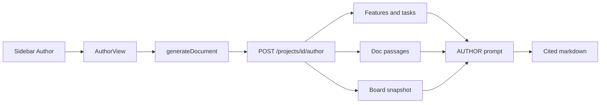

# Real Author documents

Author still hits Node `/api/author`, which returns canned SSO/CSV markdown (or Gemini over board items in a hardcoded area). Wire Generate to Vertex with features, tasks, documents, and the board snapshot so BRD, tech spec, and task tree are cited drafts from real memory.

## Spec grounding

Quoted — do not invent product behavior.

**Author** ([ui_ux_design.md](../ui_ux_design.md) §4.7):

> Turns accumulated memory into a cited document. Generate BRD / Tech spec / Task tree. Scope by area + time. Every claim carries a citation chip. Unresolved conflicts in scope → warning banner. Export Markdown / copy.

**Architecture** ([architecture.md](../architecture.md) L271–272):

> Authoring (7): assemble Decisions + Items + Source snippets for a scope → LLM drafts BRD / tech spec / task tree, every claim cited back to a Decision or Source.

**Cite or stay silent.** No Decision Records in the MVP backend — cite items, features/source quotes, uploaded-doc passages, and SQLite decisions only when they exist. Do not invent Dec #4.

## Why it is static

[`AuthorView`](../client/src/App.tsx) calls [`generateDocument`](../client/src/context/ProjectContext.tsx) → Node [`POST /api/author`](../client/server.ts). Without a Node Gemini key it returns hardcoded auth/CSV markdown. With a key it only sees **board items + decisions filtered by `area`** (`auth` / `reporting` / `general`). The area dropdown is those three demo values. Features, generated tasks, and uploaded document markdown are never sent.

## Placement

Keep the Author screen. New FastAPI route (same pattern as Memory Ask). Node `/api/author` left unused, not deleted.

## Impact analysis

- [`client/src/App.tsx`](../client/src/App.tsx) `AuthorView` — real area list from items/features; `BackendError`; keep type + time + Copy + conflict banner.
- [`client/src/context/ProjectContext.tsx`](../client/src/context/ProjectContext.tsx) `generateDocument` → FastAPI. Same inode as `projectcontext.tsx`.
- [`client/src/lib/backend.ts`](../client/src/lib/backend.ts) — `authorDocument(...)`.
- [`client/src/types.ts`](../client/src/types.ts) — `AuthorRequest` / `AuthorResponse` if needed. Keep `{ document, unresolvedConflictsCount, conflicts }` so the view does not break.
- Backend: `AUTHOR` in [`prompts.py`](../backend/app/agents/prompts.py), `backend/app/agents/author.py`, schemas + `POST /api/projects/{projectId}/author` on [`mvp.py`](../backend/app/api/routes/mvp.py).
- Reuse [`keyword_passages`](../backend/app/agents/tools.py) / Memory Ask loaders. Do not change Memory Ask or Trace.

## Implementation

### 1. Contract

`POST /api/projects/{projectId}/author`

Body (camelCase): `type` (`brd` | `spec` | `tree`), `area` (`all` or a real area slug), `timeFrame` (`30` | `90` | `365`), `boardItems` `{ id, title, description, area, status, createdAt, verdictType? }[]`, `decisions` `{ id, title, description, area }[]` (SQLite; may be empty).

Response: `{ document, unresolvedConflictsCount, conflicts: { id, title }[], citations: AskCitation[] }`.

### 2. Context + generation

Assemble then one `get_chat_model()` structured call (markdown + citations). Do **not** dump full document markdown.

1. Features whose area/name matches scope (or all if `area === 'all'`): name, summary, details, quotes, answered PM questions.
2. Tasks in those features (all statuses): title, description, AC, traces, `boardItemId`.
3. Keyword passages from `ready` docs (cap chars), same as Memory Ask.
4. Client `boardItems` filtered by area (unless `all`) and `createdAt` vs `timeFrame` when a date is present.
5. Client `decisions` similarly scoped — only if provided.

`AUTHOR` rules:

- **BRD** — background, goals, requirements, out of scope, open questions — only from context.
- **Tech spec** — architecture/constraints, interfaces, AC — only from context.
- **Task tree** — hierarchical list of real tasks/cards in scope, not invented work.
- Every factual claim cited (`item` / `source`; `decision` only if that id is in the supplied decisions). No citation ⇒ do not assert.
- If scope is empty, say so — do not emit the SSO/CSV sample.

Empty type/query → 422. `VertexNotConfigured` → structured 4xx. Do not write `chat_messages`. Do not persist the draft (in-memory workspace only, as today).

`unresolvedConflictsCount` = board items in the **filtered** scope with `verdictType === 'conflict'` (compute on server from the snapshot).

### 3. Client

- Area select: distinct areas from `state.items` + `features[].tasks[].area`, plus **All**. Drop the hardcoded Authentication / Reporting / General options.
- `generateDocument` → `authorDocument` with current board items + decisions.
- `BackendError.toDisplay()` instead of Settings-key copy.
- After generate: render markdown as today; if `citations.length`, show `CitationChip`s under the draft (same as Memory). Conflict banner unchanged.
- Copy Markdown stays. No PDF / streaming / “Send to…” in this slice.

### 4. Out of scope

- Streaming section-by-section
- PDF export
- Persisting authored docs
- Deleting Node `/api/author`
- Deprecate view

## Verification

- `poetry run pytest && poetry run ruff check .`
  - Fake model: feature+task in `auth` → BRD mentions them + `source`/`item` cite; `tree` lists those tasks only; empty scope → no SSO sample; Vertex missing → 4xx; Memory/Ask/impact tests still pass.
- `npx tsc --noEmit && npm test`
- Browser: Author → pick a real area → Generate BRD/spec/tree; draft matches uploaded features/tasks; conflict banner if a scoped card is `conflict`. If the browser tab drops, hit the route with a fake model and say what was not clicked.

---

**Completed 2026-09-27.** Author drafts BRD / tech spec / task tree from features, tasks, document passages, and a board snapshot via `get_chat_model()`. See [IMPLEMENTATION_LOG.md](../IMPLEMENTATION_LOG.md) 2026-09-27 — Real Author documents.
