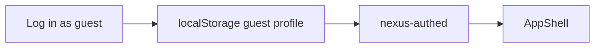

# Log in as guest

Add a Log in as guest control on the landing auth card. It skips email/password, stamps a Guest identity in localStorage, and enters the app the same way Sign in already does. No users table — this product has no real accounts.

## Spec grounding

[ui_ux_design.md](../ui_ux_design.md) has **no login page**. The gate is local-only: [`LandingPage`](../client/src/components/LandingPage.tsx) Sign in/Sign up ignore credentials and call `onEnter()`, which sets `localStorage nexus-authed=1` ([`App.tsx`](../client/src/App.tsx)). There is no user table, session, or password check.

**Choice:** identity only — stamp a Guest profile in localStorage, same projects as today, show Guest on the account chip. Not a users table. Not a new empty project.

Flag: this is a testing convenience on an unspec’d screen, not a product auth system.

## Placement

Client-only. Reuse the existing `authed` gate. Do not add FastAPI/SQLite users.



## Impact analysis

- [`client/src/components/LandingPage.tsx`](../client/src/components/LandingPage.tsx) — add the button. Sign in/Sign up stay as they are (still no real credentials).
- [`client/src/App.tsx`](../client/src/App.tsx) — `onEnter` accepts an optional profile; logout clears both `nexus-authed` and the guest profile. Sidebar above Log out: show display name (Guest vs signed-in email if we start storing one).
- New tiny helper [`client/src/lib/session.ts`](../client/src/lib/session.ts) — read/write profile. Avoid stuffing JSON in `App.tsx`.

No ProjectContext, backend, or board changes.

## Implementation

### Guest profile

```ts
{ id: string; name: string; email: string; kind: 'guest' | 'user' }
```

- **Log in as guest** (`type="button"`, not submit): create `{ id: 'guest-<timestamp>', name: 'Guest', email: 'guest-<timestamp>@nexus.local', kind: 'guest' }`, persist under `nexus-session`, then `onEnter(profile)`.
- Sign in / Sign up (unchanged behavior): if email is filled, persist `{ kind: 'user', name from email, email }`; if they submit empty… they can’t (fields required). Guest must **not** require those fields.
- Logout: remove `nexus-authed` and `nexus-session`.
- Reload: if `nexus-authed` and a session exist, keep them; if authed but no session (old clients), treat as `{ kind: 'user', name: 'You' }` so we don’t bounce people out.

### UI

- Secondary full-width button under Sign in: **Log in as guest**. Caption: “No email needed — for testing.”
- Do not invent other copy. Light/dark, existing tokens, visible focus.
- Sidebar footer (above Log out): one line, `text-xs`, the session name (`Guest` or the signed-in email).

### Out of scope

- Real passwords, backend auth, tenant isolation
- Creating a new project on guest enter
- Changing Sign in to actually validate credentials

## Verification

- `npx tsc --noEmit`
- Browser: landing → Log in as guest (no email) → app opens; sidebar shows Guest; Log out returns to landing; Sign in with email still works and shows that email. If the browser tab drops, say so.
