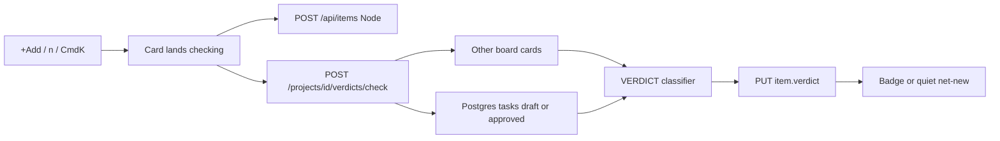

# Manual add: task-vs-task verdict

Manual board adds still land immediately (spreadsheet-fast). A Vertex classifier then compares the new card to existing board cards plus unpublished generated tasks and flags duplicate/conflict with cited ranked candidates. Net-new stays quiet. Nothing auto-blocks or auto-merges.

## Spec grounding

Quoted — do not invent product behavior.

**The magical moment** ([ui_ux_design.md](../ui_ux_design.md) §4.1, §6.1):

> On commit, the card silently enters the conflict/dedup check. A small pulsing `⟳ checking` sits on the card, then resolves to a verdict badge or nothing.
>
> 1. User adds a card (`n` / +Add / ⌘K Create). 2. Card **lands** in Inbox with checking. 3. Engine runs dedup + conflict (target &lt; 3s). 4a. NET-NEW → chip fades, no badge. 4b. DUPLICATE → dup of #88. 4c. CONFLICT → badge + cited candidates. **Nothing auto-applies.** Human confirms.

**Architecture** ([architecture.md](../architecture.md) L18, L50–52, L196–226):

> Is this new, a duplicate, or a conflict… Ranked candidates, human confirms. Cite or stay silent: no citation ⇒ net-new. Never silently miss; low confidence still surfaces, never auto-resolve.

**Your choices:** always add then flag (not block). Compare against **board cards + unpublished generated tasks** (`draft` / `approved`). Generated “Add to board” also goes through `addItem`, so it gets the same check — a visible side effect, not a second feature.

Decisions / Qdrant / DecisionRecords stay out of this slice (no Decision Records in the MVP backend). Do not invent decision ids.

## What exists today

[`addItem`](../client/src/context/ProjectContext.tsx) already optimistic-inserts with `verdict.type: 'checking'`, then `POST /api/items` on Node. [`analyseInBackground`](../client/server.ts) runs `performVerdictAnalysis`: keyword `mockAnalysis` (SSO/CSV/billing) or Node Gemini over **board items + SQLite decisions**. It does **not** see Postgres generated tasks. Polling `refreshState` every 4s is how the badge appears.

Board + drawer already render `VerdictBadge` / resolve actions. Do not rebuild those screens.

## Placement

Capability 2 (conflict/dedup), post-MVP, board create path only. Engine lives on FastAPI + `get_chat_model()` (same as Ask). Board persistence stays Node/SQLite.

## Impact analysis

- [`client/src/context/ProjectContext.tsx`](../client/src/context/ProjectContext.tsx) `addItem` / `updateItem` — after create (and on title/description change), call the new backend check and persist the verdict. Same inode as `projectcontext.tsx`.
- [`client/server.ts`](../client/server.ts) `analyseInBackground` — **stop calling it** on create/edit so the mock cannot overwrite the real verdict. `POST /api/items` still creates the card immediately. `resolveVerdict` / `/api/items/:id/verdict/resolve` stay on Node.
- [`client/src/lib/backend.ts`](../client/src/lib/backend.ts) — add `checkItemVerdict`.
- [`client/src/types.ts`](../client/src/types.ts) — `VerdictDetail` / `Candidate` already match the drawer. Add a request type if needed; do not change badge shapes.
- [`client/src/App.tsx`](../client/src/App.tsx) `handleCreateInlineCard` / [`CommandBar.tsx`](../client/src/components/CommandBar.tsx) — no UI rewrite; they already use `addItem`.
- New: `backend/app/agents/verdict.py`, `VERDICT` in [`prompts.py`](../backend/app/agents/prompts.py), Pydantic mirrors in [`schemas/mvp.py`](../backend/app/schemas/mvp.py), route on [`mvp.py`](../backend/app/api/routes/mvp.py).
- **Side effect:** cards added via **Add to board** also get a real verdict (they use `addItem`).

## Implementation

### 1. Contract

`POST /api/projects/{projectId}/verdicts/check`

Body (camelCase):

- `item`: `{ id, title, description, area }` — the new or edited card
- `boardItems`: other cards `{ id, title, description, area, status }[]` (client-owned; exclude `item.id`)

Response: existing `VerdictDetail` (`type`, `confidence`, `message`, `candidates`, optional `citation`).

Backend also loads `Task` rows for the project with `status in ('draft', 'approved')` (not `on_board`) plus parent feature name/summary. Candidate `type` stays `item` | `decision`. For a draft, `id` is the task uuid (CitationChip will not open a board card — title/snippet carry the cite). For a board match, `id` is the numeric item id. Never emit fabricated `decision` citations.

### 2. Classifier

`VERDICT` prompt + structured output via `get_chat_model()` only:

- `duplicate` — same intent as an existing board card or unpublished generated task
- `conflict` — logically contradicts another task (requirements / AC / traces), not just similar wording
- `impact` — same area/overlap without contradiction (keep so existing badges work)
- `net-new` — no cited match

Cite or stay silent. Ranked top-3 candidates. Confidence &lt; 70 → still return the flag (never drop). Empty compare set → `net-new`. `VertexNotConfigured` → structured 4xx; client keeps `checking` then toasts and falls back to `net-new` (do not re-enable the SSO mock).

No new tables. Do not write `chat_messages`.

### 3. Client

- `checkItemVerdict(projectId, item, boardItems)` in `backend.ts`.
- `addItem`: keep optimistic `checking` + Node create. Then check (other items = current board minus this id; include unpublished from already-loaded `features`). `updateItem` the `verdict`. On Vertex error: toast + `net-new`.
- `updateItem` when title or description changes: same check (Node today sets `checking` and re-runs mock — replace that trigger).
- Turn off `analyseInBackground` in `server.ts` on POST/PUT.

Reuse `VerdictBadge`, drawer Resolve, Verdicts inbox. Do not add a blocking modal.

### 4. Out of scope

- Blocking add until confirm
- Decision Records / Qdrant / two-path vector retrieval
- Auto-merge, auto-dismiss
- Changing task generation or Ask AI
- Streaming

## Verification

- `poetry run pytest && poetry run ruff check .`
  - Fake model: board duplicate → `duplicate` + item citation; draft task contradiction → `conflict` + task cite; unique title → `net-new` empty candidates; empty `GCP_PROJECT_ID` → 4xx; unpublished `on_board` tasks are not in the draft set.
- `npx tsc --noEmit && npm test`
- Browser: +Add a card that restates an existing board title → lands immediately with checking, then a cited badge (not blocked). Unique card → no badge. Confirm Memory/Ask unchanged. If browser MCP drops the tab, hit the route with a fake model / curl and say what was not clicked.

---

**Completed 2026-09-27.** Manual add lands immediately, then `POST /verdicts/check` flags duplicate/conflict with cited ranked candidates. See [IMPLEMENTATION_LOG.md](../IMPLEMENTATION_LOG.md) 2026-09-27 — Manual add: task-vs-task verdict.
