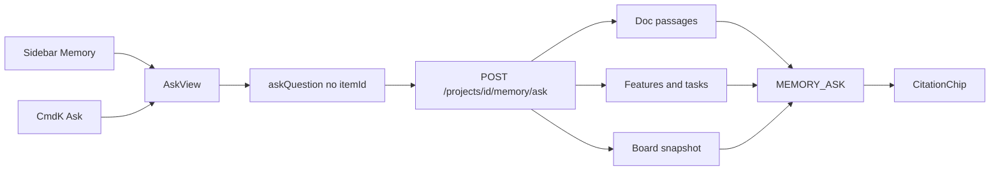

# Project Memory Ask

The Memory nav is a live UI over a Node mock. Wire it to a project-scoped Vertex ask that answers from uploaded documents, features, and tasks (plus a board snapshot), cite-or-stay-silent — same answer shape as the card Ask tab.

## Spec grounding

Quoted — do not invent product behavior.

**Memory / Ask** ([ui_ux_design.md](../ui_ux_design.md) §4.4):

> Conversational query over all items and decisions. Reached via ⌘K ("Ask…") or left nav.
> Answers are **always cited** with clickable chips (decision/item/source).
> Empty/first-run example prompts: "Is anyone already working on X?", "What did we decide about Y?", "What breaks if we change Z?", "Which requirements are still unmet?"

**Architecture** ([architecture.md](../architecture.md) L19, L263–265) — ask-a-task retrieves Item + sources and cites. **Cite or stay silent.**

**This slice:** questions about **tasks, features, or uploaded documents**. Not Decision Records (none in the MVP backend), not stage-11 runs/PRs.

## Why it is “only live”

[`AskView`](../client/src/App.tsx) (`Ask Decision Memory Layer`) calls `askQuestion(query)` with **no** `itemId`. [`askQuestion`](../client/src/context/ProjectContext.tsx) then `POST /api/ask` on **Node**, which is canned SSO/auth/CSV mocks ([`client/server.ts`](../client/server.ts)). Drawer Ask already uses FastAPI `POST /api/projects/{id}/ask`. Memory never hits that.

## Placement

Project-level Memory only. Reuse `AskResponse` / `AskCitation` / `get_chat_model()`. Retrieval is keyword passages over stored `documents.markdown` plus structured feature/task rows — **no Qdrant**. Card Ask route stays unchanged.

## Impact analysis

- [`client/src/context/ProjectContext.tsx`](../client/src/context/ProjectContext.tsx) `askQuestion` — no-`itemId` branch → FastAPI. Drawer branch unchanged.
- [`client/src/App.tsx`](../client/src/App.tsx) `AskView` — `BackendError` instead of Settings-key copy; example prompts that match real memory (drop SSO/CSV mocks). CommandBar still navigates here.
- [`client/src/lib/backend.ts`](../client/src/lib/backend.ts) — `askProjectMemory(...)`.
- [`client/src/types.ts`](../client/src/types.ts) — request type if needed; response stays `AskResponse`.
- New: `backend/app/agents/memory.py`, `MEMORY_ASK` in [`prompts.py`](../backend/app/agents/prompts.py), route on [`mvp.py`](../backend/app/api/routes/mvp.py).
- Node `/api/ask` left in place unused by Memory (do not delete ingest/author mocks in this slice).
- **Side effect:** any other `askQuestion(q)` caller (only AskView today) becomes real.

## Implementation

### 1. Contract

`POST /api/projects/{projectId}/memory/ask`

Body: `query`, optional `history` (`AskTurn[]`), `boardItems` `{ id, title, description, area, status }[]` (Node owns the board).

Response: existing `AskResponse`.

### 2. Context + classifier

Assemble, then one structured `get_chat_model()` call (no SDK outside `llm.py`):

1. **Documents** — `ready` docs with `markdown`. Reuse [`tools.py`](../backend/app/agents/tools.py) `_keyword_score` / passage windows; top passages per doc (cap total chars). Cite `type=source`, id = document id, title = filename, snippet = passage.
2. **Features** — name, summary, details, source quotes, answered PM questions. Cite `source` (quote) or a feature-named source id listed in Allowed citations.
3. **Tasks** — all statuses: title, description, AC, traces, `board_item_id` if any. Cite `item` when `board_item_id` is set; otherwise source/task id (uuid) like verdict drafts.
4. **Board snapshot** — client `boardItems` for hand-created cards not in Postgres.

`MEMORY_ASK` rules: answer only from supplied context; cite every claim; no citation ⇒ do not assert; never invent Decision Records; if the project has no docs/features/tasks, say so.

Empty query → 422. `VertexNotConfigured` → structured 4xx. Do not write `chat_messages`.

Do **not** dump full markdown into the prompt.

### 3. Client

- `askProjectMemory` in `backend.ts`.
- `askQuestion(q)` (no itemId) → that helper with current `state.items`.
- AskView: `BackendError.toDisplay()`; loading copy “thinking… searching memory”; example prompts from §4.4 that fit tasks/features/docs (not the mock SSO/CSV set).
- Keep single Q/A pane (not a chat thread). Suggested follow-ups only if the model returns them in `AskResponse` — do not invent a second response shape; skip follow-ups in v1 if they require a schema change.

### 4. Out of scope

- Streaming
- Persisting Memory threads
- Decision Records / Qdrant
- Stage 11 (runs, reviews, PRs)
- Changing card-drawer Ask
- Deleting Node `/api/ask`

## Verification

- `poetry run pytest && poetry run ruff check .`
  - Fake model: question matching a feature quote → 200 + `source` citation; question matching a board card → `item` citation; unknown → refusal, `citations: []`; no Vertex → 4xx; item-scoped `POST .../ask` tests still pass.
- `npx tsc --noEmit && npm test`
- Browser: Memory → ask something in an uploaded doc / a feature / a board task; cited chips. Ask something absent → stay silent. Card Ask still works. If the browser tab drops, hit the new route with a fake model and say what was not clicked.

---

**Completed 2026-09-27.** Memory nav answers from documents, features, tasks, and a board snapshot via `get_chat_model()`. See [IMPLEMENTATION_LOG.md](../IMPLEMENTATION_LOG.md) 2026-09-27 — Project Memory Ask.
