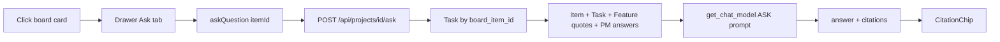

# Task drawer Ask AI

## Spec grounding

Quoted from the specs — do not invent product behavior beyond this slice.

**What the product is for** ([architecture.md](../architecture.md) L18–19, L122, L263–265):

> 2. What does this task mean / depend on / why was it decided? (ask-a-task)
>
> Ask-a-task | Reasoning Services (query) + Memory Core | Items, Decisions, Sources
>
> retrieve the Item + its Edges + originating Source snippets + related DecisionRecords → LLM answers "what is it / what it depends on / why decided," with citations.

**Card drawer** ([ui_ux_design.md](../ui_ux_design.md) §4.2):

> Opens from the right (480px, resizable to 640) over the board.
> Tabs: Overview (default), **Ask (chat scoped to this item)**, Run, Review, Impact, History, Citations.

**Ask** ([ui_ux_design.md](../ui_ux_design.md) §4.4):

> Answers are **always cited** with clickable chips (decision/item/source).
> Streaming response with a typing indicator; a "thinking… searching memory" status while retrieval runs.
> Suggested follow-ups under each answer.
> Scoped variant: the same component inside a card drawer's **Ask** tab is pre-scoped to that item ("What is this / what it depends on / why decided").

**Non-negotiables** ([CLAUDE.md](../CLAUDE.md)): cite or stay silent; human is the final approver; no invented scope.

The drawer UI already exists in [`client/src/components/Drawer.tsx`](../client/src/components/Drawer.tsx) (Ask tab, composer, `CitationChip`). It calls `askQuestion` → Node [`POST /api/ask`](../client/server.ts) which returns canned mocks (or Gemini over all SQLite items/decisions) and does **not** use the Postgres task contract, feature quotes, or Vertex.

## Placement

- Capability **3 (Ask-a-task)**, scoped to the **card-drawer Ask tab only**.
- Master plan file `.claude/plans/we-want-nexus-to-sorted-shell.md` is missing from the workspace (noted in `IMPLEMENTATION_LOG.md`). Treat phase as **post-MVP**, not a new pipeline stage.
- Dependencies that are real: board drawer + SQLite items; generated tasks with `boardItemId` ([`Task.board_item_id`](../backend/app/models/mvp.py)); feature `source_quotes` + PM answers; Vertex via [`get_chat_model()`](../backend/app/agents/llm.py).
- Dependencies that are **not** real (do not block, do not fake): Decision Records / edges in Postgres, Qdrant retrieval, streaming SSE. Cite only what we have.



## Impact analysis

Files **modified** (consumers):

- [`client/src/components/Drawer.tsx`](../client/src/components/Drawer.tsx) — Ask tab only. Overview / Impact / History / Citations unchanged. Welcome copy today invents capabilities (“scan Dec #4”); replace with scoped, honest empty state.
- [`client/src/context/ProjectContext.tsx`](../client/src/context/ProjectContext.tsx) (`askQuestion`) — **branch**: when `activeItemId` is set, call FastAPI; when omitted, keep Node `/api/ask` so [`AskView`](../client/src/App.tsx) and the Memory nav stay as they are.
- [`client/src/types.ts`](../client/src/types.ts) — add `AskCitation` + `AskResponse` (today the promise is `{ answer, citations: any[] }`). Update the `askQuestion` return type. No existing consumer assumes extra fields.
- [`client/src/lib/backend.ts`](../client/src/lib/backend.ts) — add `askAboutItem(...)`. Existing MVP helpers unchanged.
- [`backend/app/schemas/mvp.py`](../backend/app/schemas/mvp.py) — add request/response mirrors. Other schemas untouched.
- [`backend/app/api/routes/mvp.py`](../backend/app/api/routes/mvp.py) — register one new route. Existing document/feature/task routes unchanged.
- [`backend/app/agents/prompts.py`](../backend/app/agents/prompts.py) — add `ASK` only.

**Side effects a human would notice:** drawer Ask answers become real (or a Vertex error toast) instead of the SSO/auth mock. Global Memory (`AskView`, ⌘K “Ask Decision Memory”) still uses the Node mock — called out below, not silently changed.

**Same inode:** `ProjectContext.tsx` / `projectcontext.tsx` are one file on this volume — edit once.

## Implementation steps

### 1. Contract

Add to [`client/src/types.ts`](../client/src/types.ts) and mirror in Pydantic:

```ts
export interface AskCitation {
  id: string;
  type: 'item' | 'decision' | 'source';
  title: string;
  snippet?: string;
}
export interface AskTurn { role: 'user' | 'ai'; text: string }
export interface AskResponse { answer: string; citations: AskCitation[] }
```

Request body (camelCase):

- `query` (required)
- `boardItemId` (required)
- `item` snapshot: `{ title, description, area, priority }` — board lives in Node/SQLite; backend does not own the card
- `history`: last few turns (so follow-ups work; current drawer sends only the latest line)

### 2. Backend ask service

New [`backend/app/agents/ask.py`](../backend/app/agents/ask.py) — no SDK imports (keep [`test_no_direct_sdk.py`](../backend/tests/test_no_direct_sdk.py) green). Use `get_chat_model()` + structured output.

`ASK` prompt rules:

- Answer only from the supplied context. If it is not there, say so — never invent decisions, dependencies, or scope.
- Prefer: this card → generated task (description, subtasks, AC, DoD, `traces_to`) → parent feature (summary, details, source quotes, answered/skipped questions).
- Every factual claim gets a citation. No citation ⇒ do not assert.

Context assembly:

1. Always include the client `item` snapshot (works for **hand-created** cards).
2. `select(Task).where(project_id, board_item_id == boardItemId)` with feature + questions.
3. If found, add structured task + feature quotes (`origin` document/pm) + answered PM text.

Citations the model may emit: `item` (this card), `source` (a quote / filename), never a fabricated decision id. `decision` type stays on the chip for later; do not invent Decision Records.

Route: `POST /api/projects/{projectId}/ask` in [`mvp.py`](../backend/app/api/routes/mvp.py). Errors: existing `{detail: {problem, cause, fix}}`. Map `VertexNotConfigured` the same way other graphs do.

No new table. Do **not** write `chat_messages` (those are the project workflow thread).

### 3. Client wire-up

- `askAboutItem` in `backend.ts`.
- `askQuestion(q, itemId)` → backend when `itemId` is set; Node otherwise.
- Drawer: use `BackendError.toDisplay()` / toast on failure (same as other MVP calls), not only the Settings-key string (Vertex is not a Settings key).
- Opening copy: scoped to this card (“what it is / depends on / why”), plus 2–3 example prompts from §4.4 that fit a single task.
- Send `history` with each turn. Reset history when `selectedCardId` changes (already does).
- Layout: when `activeTab === 'ask'`, make the drawer body a `flex flex-col min-h-0` column — thread `flex-1 overflow-y-auto`, composer `shrink-0`. Drop the `max-h-[400px]` so the Ask composer stays at the bottom of the sheet the way Chat now does.

Reuse `CitationChip`. Do not add Run/Review. Do not rewrite Overview.

### 4. Out of scope

- Global Memory / `AskView` / CommandBar ask (Node `/api/ask` stays)
- Streaming tokens (keep the existing typing dots)
- Persisting Ask threads
- Interactive checkbox persistence / regenerating on-board cards
- Vector retrieval, impact graph, Decision Records

## Verification

- `cd backend && poetry run pytest && poetry run ruff check .`
  - Fake-model tests: published task (`board_item_id` set) → answer cites a source quote / task field; question outside context → refusal, empty or non-asserting citations; missing Vertex → structured 4xx; hand-created card (no task row) still answers from the item snapshot only.
- `cd client && npx tsc --noEmit && npm test`
- Browser: open a board card → Ask AI → ask “what does this include?” on a card added from a generated task; confirm cited chips and pinned composer. Ask something the card does not know; confirm stay-silent. Hand-created card still answers from title/description. Memory view still hits Node (no regression).

---

**Completed 2026-09-27.** Drawer Ask tab answers from the generated task + feature quotes via `get_chat_model()`. See [IMPLEMENTATION_LOG.md](../IMPLEMENTATION_LOG.md) 2026-09-27 — Task drawer Ask AI.
